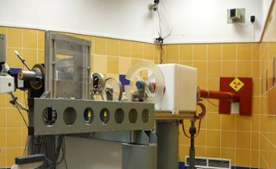

---
hide:
    - navigation
---

## Irradiation Station 1

Beam parameters:

- Energy:  0-58 MeV;
- Dose rate: 0.001 – 1 Gy/s (measured in water);
- Single scattering;
- Beam field size:    ≤ 40 mm;
- Field homogeneity ≥ 5%;
- Min flux of protons: 5e5 p/cm2·s (50MeV);
- Typical flux: 1e8 – 1e9 p/cm2·s;
- Irradiation in SOBP available;
- Sample positioning precision (> 0.1 mm);

## Irradiation Station 2

Beam parameters:

- Energy: 60 MeV (10MeV-60MeV);
- Proton beam current:     2nA – 100nA;
- Transmission to the experimental room 60-65% of extracted beam;
- Possible Energy degradation to the 10 MeV;
- Spot size:  ~ 10mm (1σ, estimated);
- Flatness ≥ 15% (10%);
- High proton beam  intensity and irradiation field configuration flexibility;

