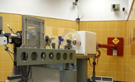
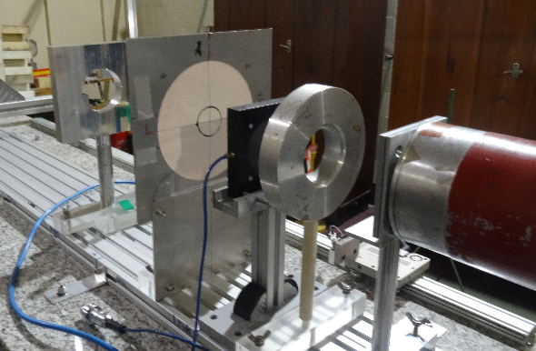

---
hide:
    - navigation
---

## Beamline 1

Beam parameters:

- Energy: 20 – 58.4 MeV;
- Min flux of protons: 5e5 p/sec/cm2 (50MeV);
- Typical flux: 1e8 – 1e9 p/sec/cm2;
- Dose rate: 0.001 – 1 Gy/sec (measured in water);
- Single scattering;
- Beam field size:    ≤ 40 mm;
- Field homogeneity ≥ 5%;
- Irradiation in SOBP available;
- Sample positioning precision (> 0.1 mm);
- Pulsed beam (double time structure);
- Irradiation in air;

## Beamline 2

Beam parameters:

- Energy: 20 – 60 MeV (varied with a PMMA degrader);
- Flux: 1e6 – 1e10 p/sec/cm2;
- Up to 2e10 p/sec/cm2 with a focused beam (field diameter 1 – 1.5 cm);
- Field size: 1 – 12 cm diameter (3 cm at maximum flux; 12 cm for energies ≤ 50 MeV and flux < 1e9 p/sec/cm2);
- Circular field; circular or rectangular collimators for small fields and for shielding parts of a board;
- Pulsed beam (double time structure);
- Irradiation in air;

Sample positioning:

- Remote-controlled XY table, travel range 38 cm × 21 cm;
- Laser crosshair for sample alignment;
- Camera view of the sample from the control room (on request);

