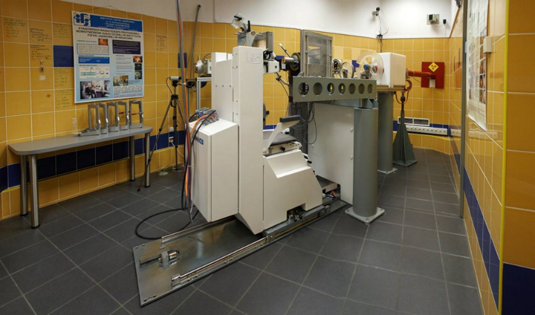

---
hide:
  - toc
---
# <b>Irradiation Station 1</b>

Beam parameters:

- Energy:  0-58 MeV;
- Dose rate: 0.001 – 1 Gy/s (measured in water);
- Single scattering;
- Beam field size:    ≤ 40 mm;
- Field homogeneity ≥ 5%;
- Min flux of protons: 5e5 p/cm2·s (50MeV);
- Typical flux: 1e8 – 1e9 p/cm2·s;
- Irradiation in SOBP available;
- Sample positioning precision (> 0.1 mm);

