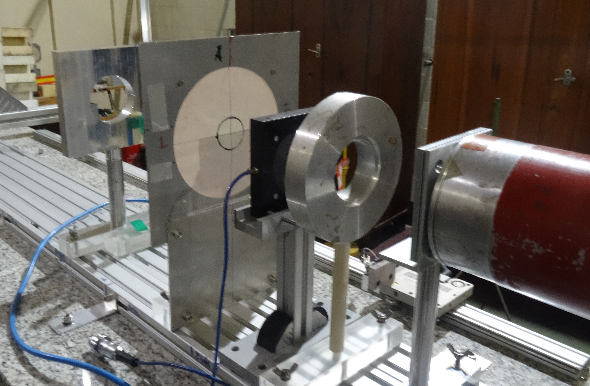

---
hide:
  - toc
---
# Irradiation Station 2

Beam parameters:

- Energy: 60 MeV (10MeV-60MeV);
- Proton beam current:     2nA – 100nA;
- Transmission to the experimental room 60-65% of extracted beam;
- Possible Energy degradation to the 10 MeV;
- Spot size:  ~ 10mm (1σ, estimated);
- Flatness ≥ 15% (10%);
- High proton beam  intensity and irradiation field configuration flexibility;

