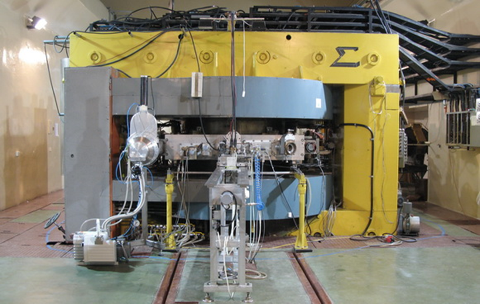

---
hide:
    - toc
enable:
    - tabs

theme:
  features:
    - [tabs]
---

Welcome to the main page of **Proton Irradiation Facility at IFJ (pIFJ)**. We operate as part of the Krakow Institute of Nuclear Physics Polish Academy of Sciences. 

### pIFJ
The Krakow **pIFJ** is a proton irradiation facility at Institute of Nuclear Physics Polish Academy of Sciences. We can perform irradiations with an energy of protons to 60 MeV with a wide range of beam intensity and various techniques of active and passive dosimetry at two irradiation stations. Parameters such as dose rate or proton beam flux are monitored during the experiments and recorded.

Our infrastructure allows us to irradiate various types of samples:  
- biological (containing living cells),  - chemical - such as nanoparticles,  
- physical - testing the radiation hardness of materials or new detectors,  
- various types of electronics 
- including for the needs of the space industry.  

We invite our guests and clients to cooperate.

